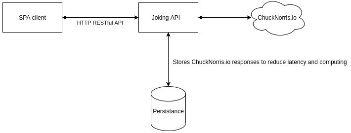

# Full stack demo

By [Jesus Gomez](http://jesusgomez.io/).

Develop a Chuck Norris fact search application. The source of information will be this API <https://api.chucknorris.io/>.

## Use cases

-   Users will be able to search by:

    -   Words

    -   Categories

    -   Randomly

-   Each search (and the results) will be stored in a database

-   The app will be available both in English and Spanish

## Architecture and application details

### Joking API

API RESTful implemented using Symfony 5.1 and PHP 7.4, Redis as persistence and DDD concept.

### SPA Client

Single Page Application (SPA) implemented using React.js.

## How to use it

### Requirements

-   Docker is required to ensure no divergence between environments.

-   Make is optional but highly recommended to drastically simplify recurrent tasks and long commands. To avoid its usage just execute the recipe of each target.

### Interaction

Only the first time `make initial-setup`.

To keep the application running just `make run` - not necessary to run the tests and checks:

-   frontend application accesible through `http://127.0.0.1:3000`

-   backend API RESTful endpoints:

    -   `GET http://127.0.0.1/category` get the list of categories

    -   `GET http://127.0.0.1/category/{category<\w+>}` get the jokes that belongs to _category_

    -   `GET http://127.0.0.1/random` get a random joke

    -   `GET http://127.0.0.1/word/{word<\w+>}` get jokes filter by _word_

> If the ports 80, 3000 or 6379 are taken in your machine, just replace them in docker/docker.env :D

To run the application tests:

-   `make test` run functional and unit tests

-   `make all-checks` run code quality and tests

Interesting commands:

-   `make coding-standards` run the configured coding standards

-   `make static-analysis` run the static analysis tool

-   `make security-check` run the Symfony security checker command

-   `make help` to see all the targets

Some coding standards issues has been dropped to test this functionality.

## Assumptions

-   Is desired to get a list of jokes by category, although the external API doesn't support it natively - just one result as random; check my hack in `backend/src/Infrastructure/Gateway/ChuckNorrisClient.php:47`!

-   A random search just return one result

## General notes

### Good practices/Highlights

-   Isolated functional tests

-   Static analysis

-   Code conventions

-   Security checks

-   Debugger and profiler (Xdebug) installed and configured for backend service. Only requires to configure your debugger/profiler client parameters

-   DRY and SOLID principles; Factory pattern...

-   PHP strict types to coerce data type correctness - bye bye to duck typing - not inferring data type but manifesting it <https://en.wikipedia.org/wiki/Duck_typing>

-   Standardised development environment to avoid divergences between developers (in this case shown just as skill/benefit)

## Notes

-   React Create Script has been downgraded to 3.4.0 to skip some Docker issue - to speed up -. It will show a security warning when installing packages

-   DDD: one bounded context - Joking - which represents the backend micro-service

-   Redis as cache and persistence layer. Only implemented in `CategoryListService`

-   PHP built-in exceptions for simplicity

-   Architecture could be simplified, and different, but wanted to match with a scalable and robust production grade application

-   No too much care about web layout; have put more focus on backend and devops stuff were my strength is

-   Some more notes into the code

## Improvements

-   Custom exceptions. Built-in has been used to simplify

-   Global error handler to catch any runtime issue - not implemented to simplify

-   Add test coverage around 70%. For simplicity and the scope of the challenge is not relevant so minimum test has been added just to show "how": unit, smoke and functional tests

-   API can be versioned to give strong consistence for clients
